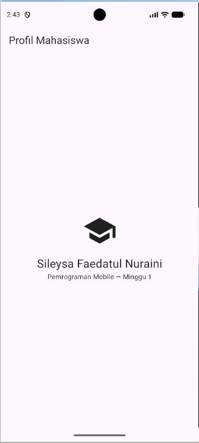
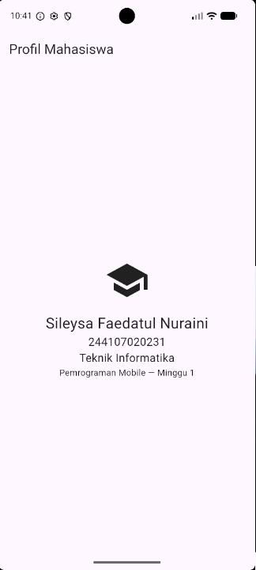

# Laporan Praktikum Mobile Programming
## Minggu 1 — Mobile Development Ecosystem & Flutter Refresh

---

## 1. Identitas

| Keterangan | Data |
|---|---|
| Nama | Sileysa Faedatul Nuraini|
| NIM | 244107020231 |
| Mata Kuliah | Pemrograman Mobile |
| Pertemuan | Minggu 1 |

---

## 2. Judul Praktikum

**Mobile Development Ecosystem & Flutter Refresh**

---

## 3. Tujuan Praktikum

Setelah mengikuti praktikum ini, tujuan yang ingin dicapai adalah:

1. Memahami evolusi pengembangan aplikasi mobile.
2. Memahami perbedaan pendekatan native, hybrid, dan cross-platform.
3. Memahami konsep dasar Flutter dan peran bahasa pemrograman Dart.
4. Memahami struktur project Flutter.
5. Memahami konsep widget tree dan UI deklaratif.
6. Mengingat kembali dasar-dasar bahasa Dart.
7. Memahami konsep null safety pada Dart.
8. Melakukan instalasi dan konfigurasi Flutter serta Android SDK.
9. Membuat dan menjalankan project Flutter.
10. Menjalankan aplikasi Flutter menggunakan Android Emulator.
11. Melakukan perubahan pada tampilan aplikasi Flutter.
12. Memahami penggunaan hot reload dan hot restart.
13. Menggunakan Git untuk melakukan version control pada project.
14. Mendokumentasikan hasil praktikum pada repository.

---

# 4. Implementasi Aplikasi

## 4.1 File Utama

File utama aplikasi Flutter terdapat pada:

```text
lib/main.dart
```

---

## 4.2 Tampilan Profil Mahasiswa

Pada praktikum, tampilan default Flutter diubah menjadi tampilan sederhana berupa profil mahasiswa.

### Kode Implementasi

> **Catatan:** `lib/main.dart` 

```dart
import 'package:flutter/material.dart';

void main() => runApp(const MyApp());

class MyApp extends StatelessWidget {
  const MyApp({super.key});
  @override
  Widget build(BuildContext context) {
    return MaterialApp(
      debugShowCheckedModeBanner: false,
      home: Scaffold(
        appBar: AppBar(title: const Text('Profil Mahasiswa')),
        body: const Center(
          child: Column(mainAxisSize: MainAxisSize.min, children: [
            Icon(Icons.school, size: 72),
            SizedBox(height: 16),
            Text('Sileysa Faedatul Nuraini', style: TextStyle(fontSize: 24)),
            Text('244107020231', style: TextStyle(fontSize: 18)),
            Text('Teknik Informatika', style: TextStyle(fontSize: 18)),
            Text('Pemrograman Mobile — Minggu 1'),
          ]),
        ),
      ),
    );
  }
}
```

---

# 5. Menjalankan Aplikasi

Aplikasi dijalankan menggunakan Android Emulator.

Perintah yang digunakan:

```bash
flutter run
```

---

# 6. Pengujian Hot Reload

Setelah melakukan perubahan pada kode, pengujian hot reload dilakukan dengan menekan:

```text
r
```

pada terminal Flutter.

Hot reload digunakan untuk melihat perubahan tampilan tanpa harus menjalankan ulang aplikasi secara keseluruhan.

### Hasil

Perubahan pada tampilan aplikasi dapat diterapkan menggunakan hot reload.

**Screenshot:**



> Simpan screenshot dengan nama `hot-reload.png` di folder `screenshots`.

---

# 7. Hasil Praktikum

Hasil praktikum berupa aplikasi Profil Mahasiswa sederhana yang dibuat menggunakan Flutter dan Dart.

### Screenshot Hasil Aplikasi

Tambahkan screenshot aplikasi pada bagian berikut:


> Simpan screenshot hasil aplikasi dengan nama `hasil-aplikasi.png` di folder `screenshots`.

---

# 8. Kendala dan Solusi

Selama proses praktikum terdapat beberapa kendala pada tahap konfigurasi.

## 8.1 Flutter Tidak Dikenali

Pada awal instalasi, ketika menjalankan:

```bash
flutter create my_first_app
```

terminal menampilkan pesan bahwa `flutter` tidak dikenali sebagai perintah.

### Solusi

Flutter SDK kemudian dikonfigurasi dan lokasi:

```text
flutter/bin
```

ditambahkan ke environment variable `PATH`.

Setelah terminal dibuka kembali, perintah Flutter dapat digunakan.

---

## 8.2 Android Toolchain Belum Siap

Pada proses awal konfigurasi, `flutter doctor` menunjukkan adanya masalah pada Android toolchain.

### Solusi

Android Studio dan Android SDK kemudian dikonfigurasi.

Android SDK Command-line Tools juga diperiksa dan dikonfigurasi agar Flutter dapat menggunakan Android toolchain.

Setelah konfigurasi selesai, `flutter doctor` kembali digunakan untuk melakukan verifikasi.

---

## 8.3 Emulator Belum Terdeteksi

Sebelum emulator dibuat, Flutter belum memiliki target Android yang dapat digunakan.

### Solusi

Android Virtual Device dibuat melalui Android Studio Device Manager.

Setelah emulator dijalankan, dilakukan pengecekan:

```bash
flutter devices
```

Hasilnya menunjukkan Android Emulator berhasil terdeteksi.

---

## 8.4 Project Tidak Menemukan `pubspec.yaml`

Ketika menjalankan:

```bash
flutter run
```

dari folder yang bukan merupakan root project Flutter, muncul pesan:

```text
Error: No pubspec.yaml file found.
This command should be run from the root of your Flutter project.
```

### Solusi

Perintah dijalankan dari folder root project Flutter:

```bash
cd C:\laragon\www\244107020231_mobile_course\01-week-1-mobile-development-ecosystem-flutter-refresh
```

Kemudian:

```bash
flutter run
```

Setelah berada di folder yang memiliki `pubspec.yaml`, project dapat dijalankan.

---

# 9. Analisis

Berdasarkan praktikum yang dilakukan, Flutter memberikan pendekatan cross-platform yang memungkinkan developer membuat aplikasi untuk berbagai platform menggunakan satu basis kode.

Struktur aplikasi Flutter dibangun menggunakan widget. Widget tersebut disusun menjadi widget tree sehingga tampilan aplikasi dapat dibentuk secara terstruktur.

Konsep UI deklaratif membuat tampilan aplikasi ditentukan berdasarkan kondisi atau state saat ini. Ketika terjadi perubahan state, widget yang berkaitan dapat melakukan rebuild sehingga UI menampilkan kondisi terbaru.

Fitur hot reload dan hot restart juga membantu mempercepat proses pengembangan karena developer dapat melihat perubahan aplikasi dengan lebih cepat.

Penggunaan Git memberikan keuntungan dalam pengelolaan perubahan kode. Setiap perubahan dapat disimpan dalam commit sehingga riwayat pengembangan project dapat dilacak.

---

# 10. Mini Assignment

Pada mini assignment dibuat aplikasi **Profil Mahasiswa** menggunakan Flutter.

### Screenshot



---

# 11. Refleksi

## 11.1 Kapan native lebih tepat dipilih daripada cross-platform?

Native lebih tepat dipilih ketika aplikasi membutuhkan akses yang sangat spesifik dan mendalam terhadap fitur atau API suatu platform.

Native juga dapat menjadi pilihan ketika kebutuhan performa sangat tinggi dan pengembang membutuhkan kontrol yang lebih langsung terhadap platform.

---

## 11.2 Bagaimana perubahan state berhubungan dengan widget tree dan UI deklaratif?

Widget tree merupakan struktur yang digunakan Flutter untuk menyusun tampilan aplikasi.

Dalam pendekatan UI deklaratif, tampilan aplikasi menggambarkan kondisi atau state aplikasi saat ini.

Ketika state berubah, Flutter dapat melakukan rebuild pada widget yang berkaitan. Widget tersebut kemudian menghasilkan tampilan berdasarkan state terbaru.

---

## 11.3 Mengapa commit kecil dengan pesan jelas bermanfaat bagi pekerjaan tim dan portfolio?

Commit kecil dengan pesan yang jelas membuat perubahan project lebih mudah dipahami dan dilacak.

Selain itu, riwayat commit yang rapi dapat menjadi bagian dari portfolio karena menunjukkan proses pengembangan project dan kemampuan menggunakan version control.

---

# 12. Kesimpulan

Praktikum Minggu 1 memberikan pemahaman dasar mengenai ekosistem pengembangan aplikasi mobile dan penggunaan Flutter.

Pada praktikum ini telah dipelajari perbedaan pendekatan native, hybrid, dan cross-platform serta konsep dasar Flutter dan Dart.

Selain itu, telah dilakukan instalasi dan konfigurasi Flutter, Android Studio, Android SDK, serta Android Emulator.

Project `01-week-1-mobile-development-ecosystem-flutter-refresh` berhasil dibuat dan dijalankan pada Android Emulator. Project juga menggunakan struktur Flutter yang terdiri dari `lib`, `android`, `ios`, `web`, `test`, dan `pubspec.yaml`.

Melalui praktikum ini juga dipahami konsep widget tree, UI deklaratif, state, hot reload, hot restart, serta penggunaan Git untuk mengelola perubahan project.

Dengan demikian, praktikum ini menjadi dasar untuk memahami pengembangan aplikasi mobile menggunakan Flutter pada pertemuan-pertemuan berikutnya.

---
