# Laporan Praktikum #02 — Declarative UI & Responsive Design

| Keterangan | Data |
|---|---|
| Nama | Sileysa Faedatul Nuraini|
| NIM | 244107020231 |
| Mata Kuliah | Pemrograman Mobile |
| Pertemuan | Minggu 2 |

---

## 1. Tujuan Pembelajaran

Setelah menyelesaikan praktikum ini, mahasiswa mampu:

- Menjelaskan prinsip declarative UI dan hubungan antara widget, konfigurasi, serta state.
- Menggunakan StatelessWidget, StatefulWidget, Container, Row, Column, dan Expanded.
- Membedakan komponen Material 3 dan Cupertino untuk kebutuhan platform yang berbeda.
- Membangun layout responsif untuk ukuran layar mobile dan tablet.
- Menerapkan theme, dark mode, styling, dan aksesibilitas dasar.

## 2. Kartu Profil Sederhana (Latihan Widget Dasar)

Membuat project baru dan mengisi `lib/main.dart` dengan `ProfileApp` yang menampilkan `ProfileCard` berisi avatar, nama, NIM, dan kelas menggunakan `Container`, `Column`, `Row`, dan `Expanded`.

**Eksperimen warm-up yang dilakukan:**

1. Menghapus `Expanded` pada baris nama 

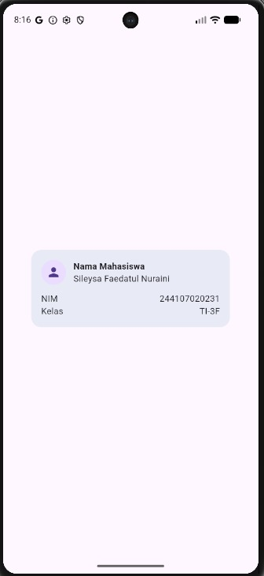

2. Mengganti `mainAxisSize: MainAxisSize.min` ke nilai default 

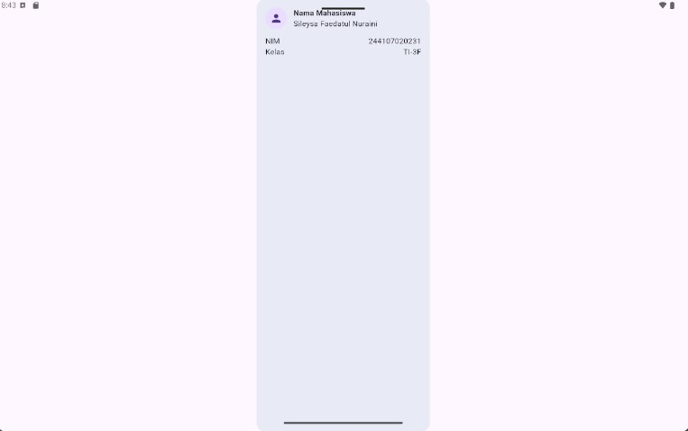

3. Menambahkan baris data baru (`Email`) dengan pola `Row` + `Expanded` 

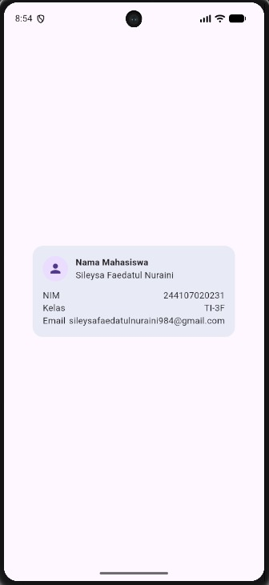

## 3. Eksperimen Layout

1. Mengubah breakpoint dari `700` ke nilai lain 

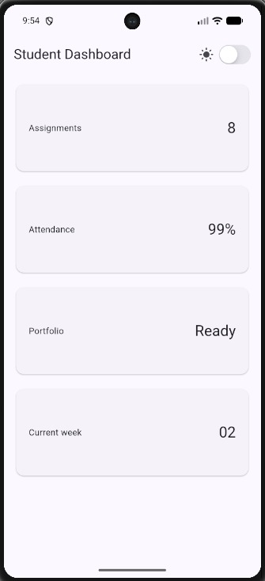

2. Mengubah `themeMode` menjadi `ThemeMode.dark`, lalu mengembalikan ke `ThemeMode.system` 

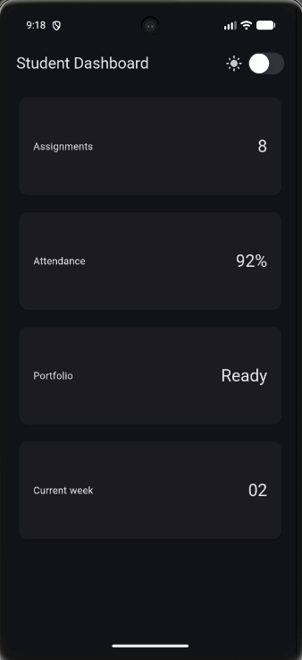

3. Menguji aplikasi pada beberapa ukuran layar emulator 

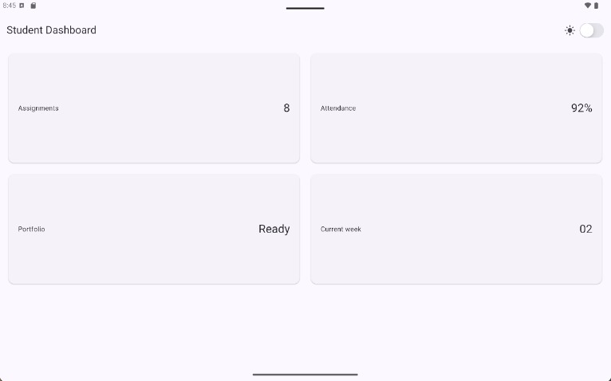

4. Menambahkan `Semantics`/label bermakna untuk elemen penting bagi screen reader 


## 4. Tugas Utama — Academic Overview Dashboard

| Layar Sempit (Mobile) | Layar Lebar (Tablet) |
|---|---|
| 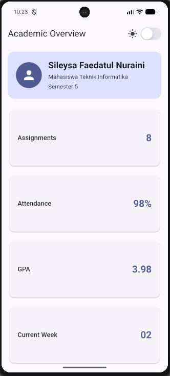 | 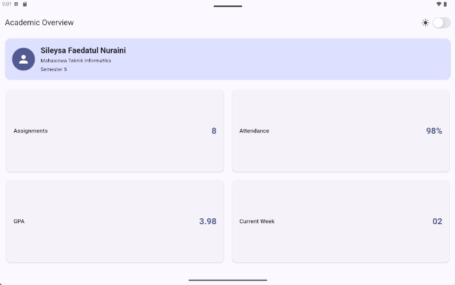 |

## 5. AI Prompt Challenge

### 5.1 Prompt Desain

**Prompt:** "Bandingkan dua tata letak dashboard akademik untuk Flutter: versi `GridView` dan versi `LayoutBuilder` + `Column`. Jelaskan trade-off responsif dan aksesibilitasnya."

**Ringkasan output AI:** GridView lebih cocok untuk menampilkan beberapa kartu informasi, sedangkan LayoutBuilder dapat digunakan untuk menyesuaikan layout berdasarkan ukuran layar.

**Keputusan yang diambil & alasan teknis:** Menggunakan LayoutBuilder dengan GridView untuk dashboard akademik. Kombinasi ini membuat jumlah kolom dapat berubah sesuai lebar layar, sehingga tampilan tetap responsif dan rapi pada berbagai ukuran perangkat.

### 5.2 Prompt Penguatan Konsep

**Prompt:** "Jelaskan kapan penggunaan `Expanded` justru menyebabkan overflow di dalam `Row`, beri contoh kode yang gagal dan perbaikannya."

**Ringkasan output AI:** Expanded dapat menyebabkan overflow atau error jika digunakan di dalam Row yang tidak memiliki batas lebar yang jelas (unbounded width).

**Keputusan yang diambil & alasan teknis:** Menggunakan Expanded pada Row yang memiliki ukuran atau batas lebar yang jelas. Expanded membutuhkan ruang yang terbatas untuk membagi ruang secara tepat. Dengan begitu, layout dapat menghindari error dan teks tidak keluar dari batas layar.

**Contoh Kode Gagal**

```dart
Row(
  children: [
    SingleChildScrollView(
      scrollDirection: Axis.horizontal,
      child: Row(
        children: [
          Expanded(  // ❌ error: parent Row ini punya lebar unbounded
            child: InfoCard(title: 'IPK', value: '3.75'),
          ),
          InfoCard(title: 'SKS', value: '98'),
        ],
      ),
    ),
  ],
)
```

**Perbaikan Kode**

```dart
Row(
  children: [
    SingleChildScrollView(
      scrollDirection: Axis.horizontal,
      child: Row(
        children: [
          SizedBox(
            width: 160,
            child: InfoCard(title: 'IPK', value: '3.75'),
          ),
          const SizedBox(width: 12),
          SizedBox(
            width: 160,
            child: InfoCard(title: 'SKS', value: '98'),
          ),
        ],
      ),
    ),
  ],
)
```

### 5.3 Verification Prompt

**Prompt:** "Periksa kembali rekomendasi layout di atas: apakah tetap responsif di bawah 600px, apakah mengurangi aksesibilitas, dan apakah ada widget yang tidak tersedia di Flutter stabil saat ini?"

**Hasil verifikasi:** Layout dapat menyesuaikan ukuran layar dengan LayoutBuilder, penggunaan Semantics membantu aksesibilitas, dan widget yang digunakan tersedia di Flutter.

**Bukti verifikasi (test/screenshot):** 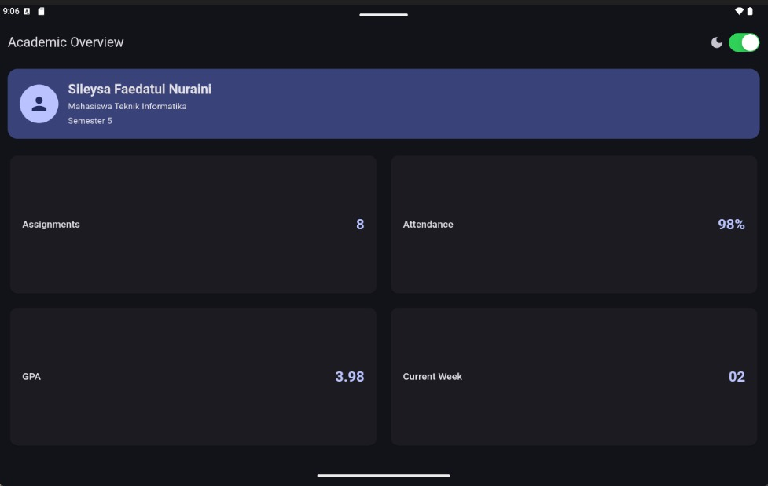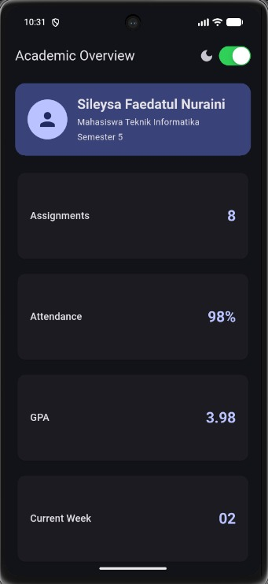

## 6. Refactoring Challenge

1. **Ekstrak widget reusable** — kartu informasi diekstrak menjadi `InfoCard` yang menerima parameter `title` dan `value` untuk menghindari duplikasi widget.
2. **Theming konsisten** — warna dan ukuran yang di-hardcode diganti dengan `Theme.of(context)` agar mengikuti tema terang/gelap otomatis.
3. **Breakpoint terpusat** — breakpoint dipindahkan ke satu konstanta bernama, misal:
   ```dart
   const kWideBreakpoint = 700;
   ```
4. **`flutter analyze`** — dijalankan dan dipastikan tidak ada error maupun warning baru.

**Hasil `flutter analyze`:**

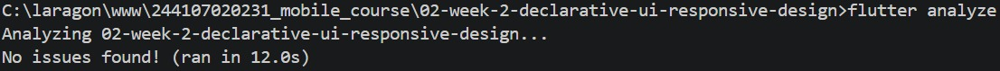

## 7. Testing Dasar

Widget test ditambahkan pada folder `test/` untuk memverifikasi perilaku responsif menggunakan `tester.view`:

```dart
import 'package:flutter/material.dart';
import 'package:flutter_test/flutter_test.dart';
import 'package:responsive_dashboard/main.dart';

void main() {
  testWidgets('Dashboard satu kolom di layar sempit', (tester) async {
    tester.view.physicalSize = const Size(400, 800);
    tester.view.devicePixelRatio = 1.0;
    addTearDown(tester.view.reset);

    await tester.pumpWidget(const DashboardApp());

    final width = tester.getSize(find.byType(Card)).width;
    expect(width, lessThan(700));
  });

  testWidgets('Dashboard dua kolom di layar lebar', (tester) async {
    tester.view.physicalSize = const Size(1200, 800);
    tester.view.devicePixelRatio = 1.0;
    addTearDown(tester.view.reset);

    await tester.pumpWidget(const DashboardApp());

    final width = tester.getSize(find.byType(Card)).width;
    expect(width, greaterThan(500));
  });
}
```

**Hasil `flutter test`:**

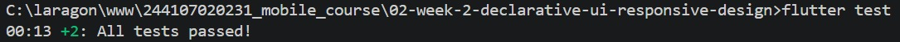


## 8. Refleksi

### 8.1 Apa perbedaan cara berpikir imperative dan declarative saat membangun UI?
Imperative berfokus pada bagaimana UI dibuat, yaitu dengan memberikan langkah-langkah secara langsung untuk mengubah tampilan. Sedangkan declarative berfokus pada apa yang ingin ditampilkan berdasarkan kondisi atau state tertentu. Flutter menggunakan pendekatan declarative sehingga UI akan diperbarui berdasarkan perubahan state.

### 8.2 Kapan `Expanded` membantu dan kapan penggunaannya justru menghasilkan layout error?
Expanded membantu ketika kita ingin widget mengisi ruang yang tersedia di dalam Row atau Column secara fleksibel. Namun, Expanded dapat menyebabkan layout error jika digunakan pada kondisi yang memiliki ukuran tidak terbatas, misalnya di dalam Column yang berada pada SingleChildScrollView, karena Flutter tidak mengetahui batas ruang yang harus diberikan.

### 8.3 Bagaimana breakpoint dan theme memengaruhi pengalaman pengguna?
Breakpoint membuat tampilan aplikasi dapat menyesuaikan ukuran layar, misalnya menggunakan satu kolom pada layar kecil dan dua kolom pada layar yang lebih lebar. Theme mengatur tampilan seperti warna, teks, dan mode terang atau gelap. Keduanya membuat aplikasi lebih nyaman, konsisten, dan mudah digunakan pada berbagai perangkat.

### 8.4 Apa yang Anda verifikasi dari rekomendasi AI setelah tugas inti selesai?
Saya memastikan layout tampil dengan benar pada ukuran layar berbeda, tidak terdapat error atau overflow, fitur light/dark mode berjalan, serta kode dan hasilnya sesuai dengan kebutuhan tugas. Rekomendasi AI tidak langsung digunakan tanpa melakukan pengecekan terlebih dahulu.
