# Laporan Praktikum 03 — Navigation & State Management

| Keterangan | Data |
|---|---|
| Nama | Sileysa Faedatul Nuraini|
| NIM | 244107020231 |
| Mata Kuliah | Pemrograman Mobile |
| Pertemuan | Minggu 3 |

---

## 1. Tujuan pembelajaran

Setelah menyelesaikan codelab ini, mahasiswa mampu:

- Menjelaskan konsep navigasi, route, dan perbedaan Navigator 1.0 dengan GoRouter;
- Menerapkan navigasi multi-page dengan GoRouter, termasuk passing argument dan deep link sederhana;
- Menjelaskan mengapa state management diperlukan dan cara kerja Riverpod (Provider, ConsumerWidget, Notifier);
- Menggunakan AsyncValue untuk menangani state loading, error, dan success pada UI;
- Membangun aplikasi ToDo dengan navigasi dan Riverpod, lalu memverifikasi hasilnya dengan widget test sederhana.

## 2. Konsep navigasi dan GoRouter

### Praktikum 1 — Aplikasi multi-page dengan GoRouter

| Home Page | Detail Page |
|---|---|
| 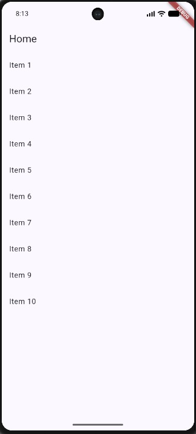 | 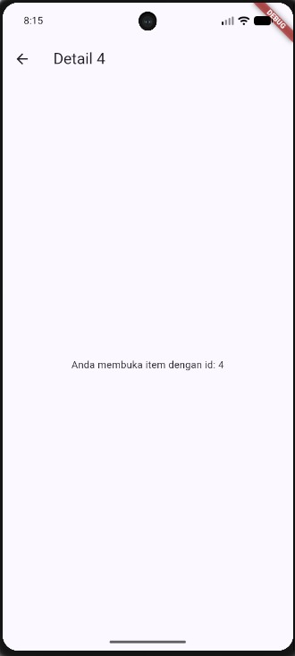 |

## 3. State management dengan Riverpod

### Praktikum 2 — Aplikasi ToDo dengan Riverpod

| ToDo Riverpod Kosong | ToDo Riverpod Isi |
|---|---|
| 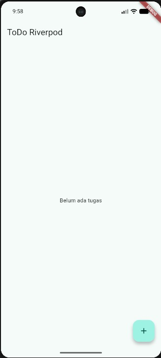 | 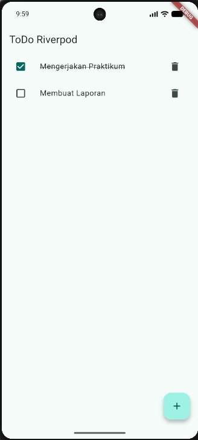 |

## 4. AsyncValue: loading, error, success

### Praktikum 3 — Uji ketiga state

Halaman Produk Loading

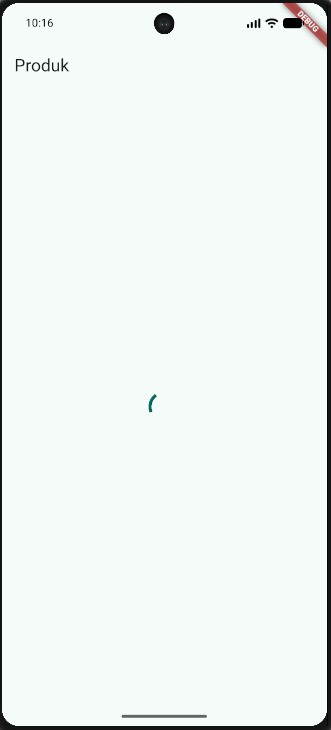

Halaman Produk Berhasil

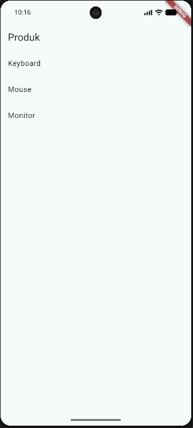

Halaman Produk Gagal

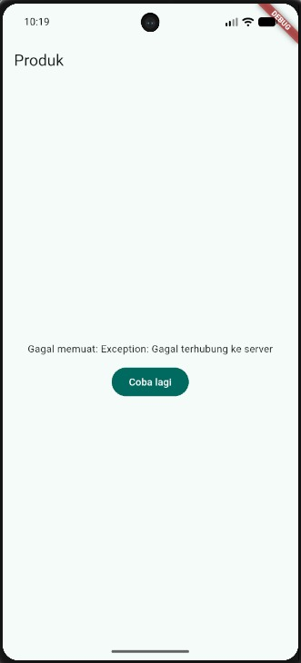

## 5. AI Challenge

### AI Prompt Challenge

Buatkan halaman Flutter bernama StatsPage menggunakan flutter_riverpod.
Requirements:
- ConsumerWidget dengan satu AsyncNotifierProvider yang mensimulasikan
  pengambilan data statistik (delay 2 detik, kadang gagal 30%).
- UI harus menangani loading (spinner), error (pesan + tombol retry),
  dan success (ListView 3 item).
- Berikan unit test untuk notifier-nya.
Jelaskan setiap bagian kode dalam komentar.

### AI Verification Checklist

| Checklist | Hasil Verifikasi | Temuan |
|---|---|---|
| State diubah secara immutable | ✅ Sesuai | Pada `TodoListNotifier`, state tidak diubah menggunakan `state.add()` atau mutasi langsung. Data dibuat menjadi list baru menggunakan spread operator `[...]`. |
| `ref.watch` digunakan di `build` dan `ref.read` pada callback | ✅ Sesuai | `ref.watch()` digunakan di dalam `build()` untuk mengamati perubahan state, sedangkan `ref.read()` digunakan pada callback seperti tambah, toggle, hapus, dan retry. |
| Ketiga state `AsyncValue` ditangani | ✅ Sesuai | `StatsPage` menangani kondisi `loading`, `error`, dan `data` menggunakan `statsAsync.when()`. |
| Provider memiliki tipe eksplisit dan tidak duplikat | ✅ Sesuai | `todoListProvider`, `filteredTodoProvider`, dan `statsProvider` memiliki deklarasi tipe yang jelas dan tidak terdapat provider duplikat. |
| Tidak menggunakan API Riverpod versi lama | ✅ Sesuai | Implementasi menggunakan `Notifier`, `AsyncNotifier`, `NotifierProvider`, `AsyncNotifierProvider`, dan `ConsumerWidget`. Tidak menggunakan `StateNotifierProvider` atau `StateProvider`. |
| `flutter analyze` | ✅ Lolos | Tidak ditemukan error maupun warning. |
| `flutter test` | ✅ Lolos | Seluruh test berhasil dijalankan. |

Halaman Produk Loading


Halaman Produk Success


Halaman Produk Error


| Flutter Analyze | Flutter Test |
|---|---|
| 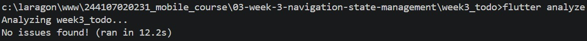 | 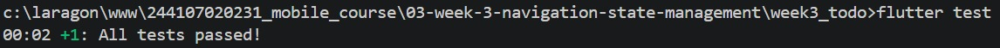 |

## 6. Refactoring dan testing

### Refactoring Challenge

1. Pisahkan widget ToDo menjadi TodoTile

```dart
class TodoTile extends StatelessWidget {
  const TodoTile({
    super.key,
    required this.todo,
    required this.onToggle,
    required this.onDelete,
  });

  final Todo todo;
  final VoidCallback onToggle;
  final VoidCallback onDelete;

  @override
  Widget build(BuildContext context) {
    return ListTile(
      leading: Checkbox(
        value: todo.done,
        onChanged: (_) => onToggle(),
      ),
      title: Text(
        todo.title,
        style: TextStyle(
          decoration:
              todo.done ? TextDecoration.lineThrough : null,
        ),
      ),
      trailing: IconButton(
        icon: const Icon(Icons.delete),
        onPressed: onDelete,
      ),
    );
  }
}
```

2. Ekstrak logika filter menjadi Provider

Di file todo_provider.dart
```dart
final filteredTodoProvider = Provider<List<Todo>>((ref) {
  final todos = ref.watch(todoListProvider);

  return todos.where((todo) => !todo.done).toList();
});
```

3. Integrasikan ToDo dengan GoRouter

Pada file main.dart
Bagian routing:
```dart
static final GoRouter _router = GoRouter(
  initialLocation: '/',
  routes: [
    StatefulShellRoute.indexedStack(
      builder: (
        context,
        state,
        navigationShell,
      ) {
        return Scaffold(
          body: navigationShell,
          bottomNavigationBar: NavigationBar(
            selectedIndex:
                navigationShell.currentIndex,
            onDestinationSelected: (index) {
              navigationShell.goBranch(index);
            },
            destinations: const [
              NavigationDestination(
                icon: Icon(Icons.check_circle_outline),
                selectedIcon: Icon(Icons.check_circle),
                label: 'ToDo',
              ),
              NavigationDestination(
                icon: Icon(Icons.bar_chart_outlined),
                selectedIcon: Icon(Icons.bar_chart),
                label: 'Stats',
              ),
            ],
          ),
        );
      },
    ),
  ],
)
```

Kemudian route ToDo:
```dart
StatefulShellBranch(
  routes: [
    GoRoute(
      path: '/',
      builder: (context, state) {
        return const TodoPage();
      },
    ),
  ],
),
```

Dan route Statistik:
```dart
StatefulShellBranch(
  routes: [
    GoRoute(
      path: '/stats',
      builder: (context, state) {
        return const StatsPage();
      },
    ),
  ],
),
```

| Flutter Analyze | Flutter Test |
|---|---|
|  |  |

## 7. Tugas dan Refleksi

| Halaman ToDo | Halaman Statistik |
|---|---|
| 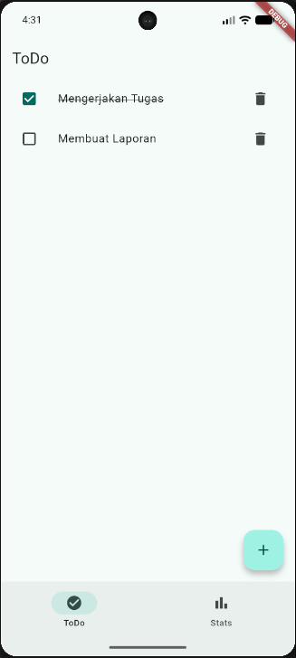 | 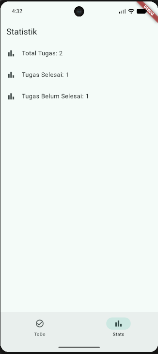 |

### Refleksi

1. Kapan setState masih cukup, dan kapan state harus naik ke Riverpod?

`setState` masih cukup digunakan untuk state sederhana yang hanya dibutuhkan oleh satu widget, misalnya mengubah nilai input atau membuka dan menutup komponen tertentu. Namun, jika state digunakan oleh beberapa widget atau halaman dan membutuhkan pengelolaan yang lebih terstruktur, state dapat dikelola menggunakan Riverpod. Pada aplikasi ini, daftar ToDo menggunakan Riverpod karena datanya perlu diakses dan diperbarui oleh beberapa bagian aplikasi.

2. Apa perbedaan context.go dan context.push, dan kapan masing-masing tepat digunakan?

`context.go()` digunakan untuk berpindah ke route tertentu dan mengganti lokasi yang sedang aktif. Sedangkan `context.push()` digunakan untuk menambahkan route baru ke navigation stack sehingga halaman sebelumnya masih dapat dikembalikan dengan tombol back.

`context.go()` lebih tepat digunakan untuk perpindahan antar halaman utama, sedangkan `context.push()` lebih cocok untuk membuka halaman detail yang masih memiliki hubungan dengan halaman sebelumnya.

3. Bagaimana AsyncValue mencegah bug dibanding tiga boolean terpisah?

`AsyncValue` menyediakan pengelolaan state asynchronous dalam satu struktur yang memiliki kondisi seperti `loading`, `error`, dan `data`. Dengan menggunakan `AsyncValue`, kemungkinan terjadi kondisi state yang tidak konsisten dapat dikurangi.

Jika menggunakan tiga boolean terpisah seperti `isLoading`, `hasError`, dan `hasData`, beberapa nilai dapat secara tidak sengaja bernilai `true` secara bersamaan. `AsyncValue` membuat penanganan kondisi asynchronous menjadi lebih terstruktur dan mudah dipahami.

4. Bagian mana dari hasil AI yang Anda perbaiki, dan mengapa?

Hasil kode dari AI tidak langsung digunakan, tetapi disesuaikan dengan struktur project yang sudah dibuat. Bagian yang diperiksa dan disesuaikan meliputi provider, import, routing, serta penggunaan `AsyncNotifier`, `AsyncValue`, `ref.watch`, dan `ref.read`.

Saya juga memastikan kode tidak menggunakan pola Riverpod versi lama dan state ToDo diubah secara immutable. Setelah diperbaiki, kode diuji menggunakan `flutter analyze` dan `flutter test`. Hasilnya tidak ditemukan issue pada analisis dan seluruh test berhasil dijalankan.