# Laporan Praktikum 04 — Networking & REST API

| Keterangan | Data |
|---|---|
| Nama | Sileysa Faedatul Nuraini|
| NIM | 244107020231 |
| Mata Kuliah | Pemrograman Mobile |
| Pertemuan | Minggu 4 |

---

# Tujuan

Tujuan dari project ini adalah:

1. Menjelaskan konsep HTTP, REST API, dan JSON;
2. Memetakan JSON ke model Dart (serialization) dengan aman null;
3. Menerapkan repository pattern dasar sehingga UI tidak memanggil API secara langsung;
4. Mengonfigurasi Dio (base URL, timeout, interceptor) dan menangani error jaringan;
5. Menampilkan state loading, error, empty, dan success pada UI dengan AsyncValue + Riverpod;
6. Menerapkan pagination dasar (infinite scroll).

# Praktikum 1: Dio dan model data

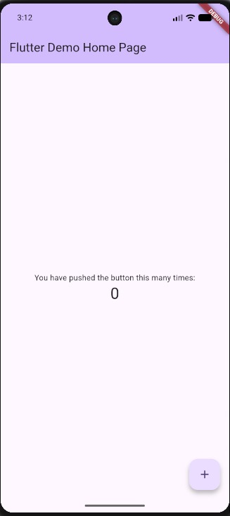

# Praktikum 2: Provider dan error handling

| Internet Normal Nomor 1-10 | Internet Normal Nomor 91-100 |
|---|---|
| 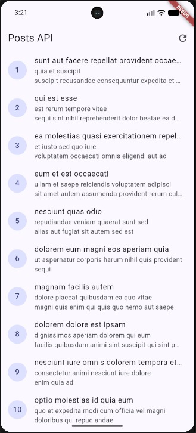 | 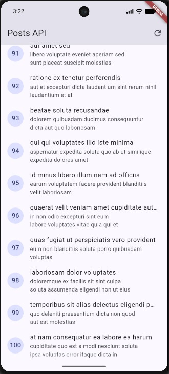 |

| Mode Pesawat | URL Salah |
|---|---|
| 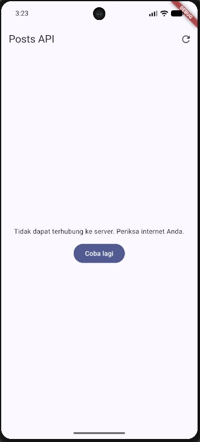 | 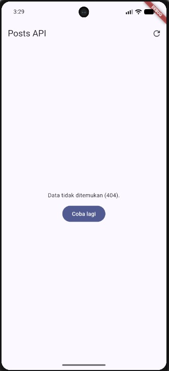 |

# Praktikum 3: Pagination dasar

| Halaman Pertama | Halaman Terakhir |
|---|---|
| 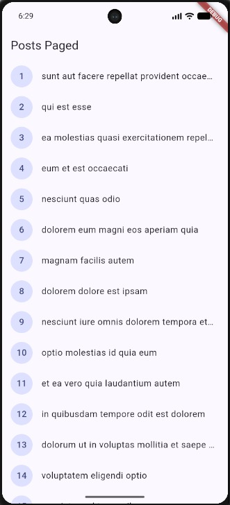 | 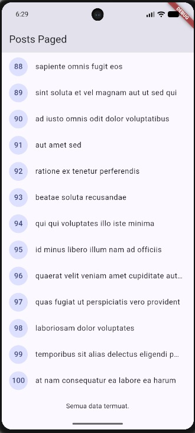 |

| Flutter Analyze | Flutter Test |
|---|---|
| 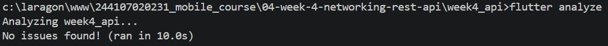 | 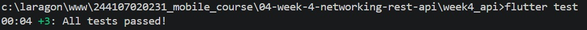 |

# AI Challenge

Pada pengerjaan project ini, AI digunakan sebagai alat bantu untuk:

1. Membantu memahami konsep REST API.
2. Membantu membuat struktur kode awal.
3. Membantu menjelaskan error.
4. Membantu membuat contoh unit test.
5. Membantu melakukan refactoring.

Namun, kode dari AI tidak langsung digunakan seluruhnya.

Kode diperiksa dan disesuaikan kembali dengan struktur project, kebutuhan tugas, dan hasil testing.

```markdown
Dokumentasi AI Challenge dapat dilihat pada:


Dokumentasi tersebut berisi:

1. Prompt yang digunakan.
2. Hasil dari AI.
3. Bagian kode yang diperbaiki.
4. Alasan teknis dilakukan perbaikan.
5. Hasil pengujian setelah perbaikan.

Salah satu perbaikan yang dilakukan adalah menyesuaikan implementasi provider dengan versi Riverpod yang digunakan pada project. Hasil AI tidak langsung digunakan tanpa pemeriksaan, tetapi dianalisis, diperbaiki, dan diuji kembali.

# Refactoring dan testing

## 1. Ekstrak widget baris post menjadi PostTile tersendiri agar ListView.builder pendek dan mudah diuji.

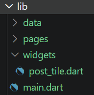

## 2. Pindahkan friendlyErrorMessage ke file lib/data/network_errors.dart agar bisa dipakai ulang halaman paged dan non-paged.

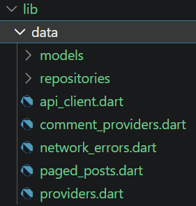

## 3. Tambahkan halaman detail post dengan GoRouter (/post/:id) yang menampilkan title dan body lengkap, state detail diambil dari list yang sudah dimuat atau via repository bila langsung dibuka.

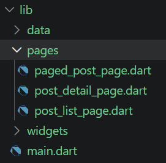

## Analyze dan Testing

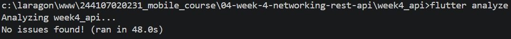

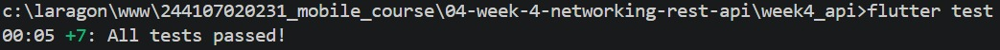

# Refleksi

## 1. Mengapa UI dilarang memanggil Dio langsung? Apa yang rusak jika aturan ini dilanggar?

UI sebaiknya tidak langsung memanggil Dio karena akan membuat kode menjadi sulit dipelihara.

Jika UI langsung mengakses Dio, maka halaman akan menangani terlalu banyak hal seperti:

- HTTP request.
- Parsing JSON.
- Error handling.
- State management.
- Tampilan.

Dengan Repository Pattern, tanggung jawab tersebut dipisahkan.

Dengan begitu kode lebih terstruktur dan lebih mudah dilakukan testing.

## 2. Kapan pagination client-side cukup, dan kapan harus mengandalkan pagination server (_page/_limit)?

Client-side pagination cukup digunakan ketika jumlah data relatif sedikit dan seluruh data masih memungkinkan untuk diambil sekaligus.

Server-side pagination lebih sesuai ketika jumlah data sangat banyak karena data dapat dimuat secara bertahap dari server.

## 3. Bagaimana exception repository berubah menjadi AsyncError tanpa try/catch di setiap widget? Kapan try/catch eksplisit tetap dibutuhkan?

Pada AsyncNotifier, method build() mengembalikan Future.

Contohnya:

```dart
@override
Future<List<Post>> build() async {
  final repository = ref.watch(postRepositoryProvider);
  return repository.fetchPosts();
}
```

Jika repository menghasilkan exception, Riverpod dapat mengubah kondisi tersebut menjadi AsyncError.

Dengan demikian widget dapat menangani kondisi error melalui state asynchronous tanpa harus menuliskan try/catch untuk request API pada setiap widget.

try/catch tetap dibutuhkan ketika aplikasi ingin melakukan penanganan exception secara eksplisit, misalnya ketika melakukan refresh dan ingin mengatur state secara manual.

## 4. Bagian mana dari hasil AI yang Anda perbaiki, dan mengapa?

Hasil AI tidak langsung digunakan seluruhnya. Pada implementasi awal terdapat penggunaan API Riverpod yang tidak sesuai dengan versi Riverpod yang digunakan pada project.

Kode kemudian diperbaiki agar sesuai dengan API dan struktur project yang digunakan.

Selain itu dilakukan penyesuaian pada:

1. Struktur provider.
2. Error handling.
3. Import.
4. Unit testing.
5. Fake repository.

Setelah diperbaiki, project diverifikasi menggunakan:

`flutter analyze` dan `flutter test`