# Laporan Praktikum 05 — Local Storage & Offline First

| Keterangan | Data |
|---|---|
| Nama | Sileysa Faedatul Nuraini|
| NIM | 244107020231 |
| Mata Kuliah | Pemrograman Mobile |
| Pertemuan | Minggu 5 |

---

# Tujuan

Setelah menyelesaikan codelab ini, mahasiswa mampu:

1. Menjelaskan perbedaan penyimpanan key-value, relasional, dan NoSQL di perangkat;
2. Menyimpan preferensi sederhana (tema, terakhir dibuka) dengan SharedPreferences;
3. Menerapkan CRUD catatan dengan SQLite (sqflite) melalui repository lokal;
4. Menerapkan pola offline-first: cache-first read, dirty flag, dan antrean sinkronisasi;
5. Menampilkan state loading, error, empty, dan success untuk data lokal dengan Riverpod;
6. Menguji repository lokal dengan repository palsu (tanpa database sungguhan).

# Praktikum 1: SharedPreferences

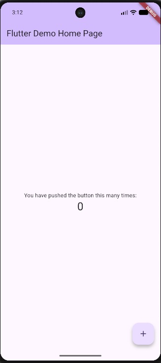

# Praktikum 2: SQLite dan repository catatan

| Sebelum Sync | Sesudah Sync |
|---|---|
| 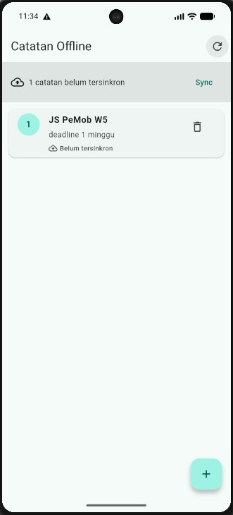 | 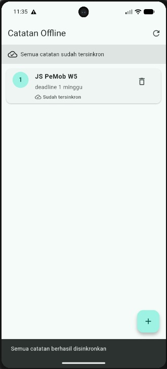 |

# Praktikum 3: Cache-first dan antrean sync

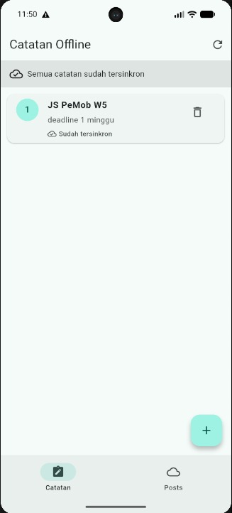

| Halaman Posts Offline | Halaman Posts Online |
|---|---|
| 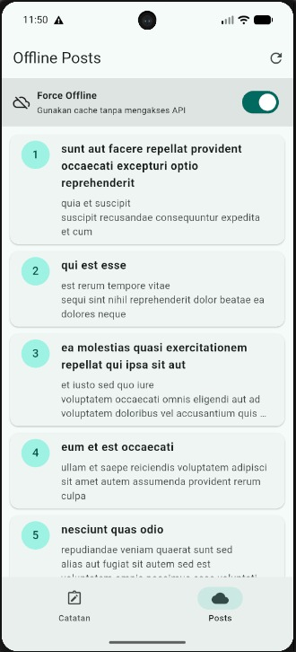 | 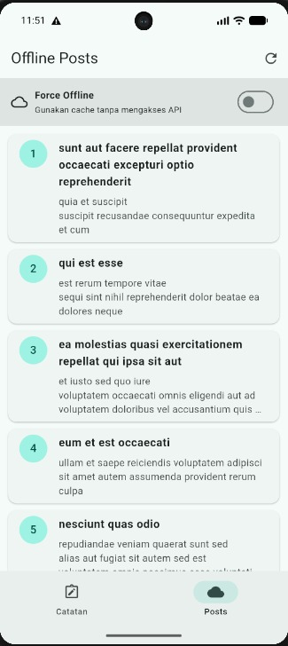 |

| Halaman Posts NoInternet + Offline | Halaman Posts NoInternet + Online |
|---|---|
| 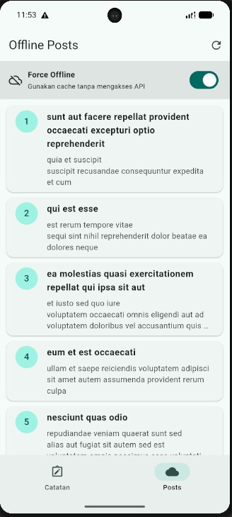 | 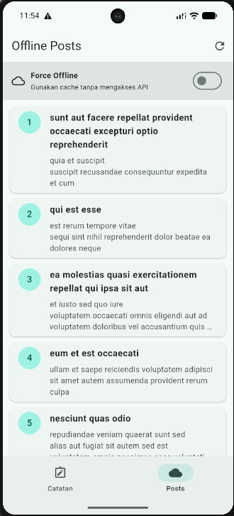 |

# AI Challenge

Pada AI Challenge dilakukan perbandingan beberapa teknologi local storage:

1. SharedPreferences
2. Hive
3. SQLite / sqflite
4. Drift

Kriteria yang dibandingkan meliputi:

1. kompleksitas query
2. kebutuhan relasi
3. reaktivitas
4. type-safety
5. boilerplate
6. testing
7. kebutuhan aplikasi Offline Notes

Dokumentasi AI Challenge:

[Dokumentasi AI](docs/)

# Refactoring, testing, dan error umum

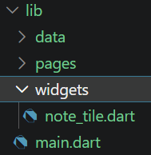

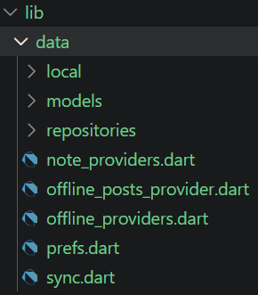

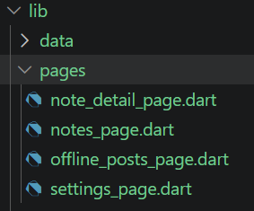

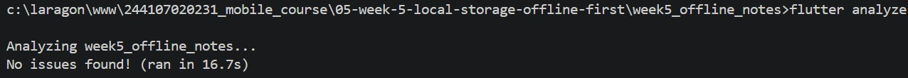

| Flutter Test 1 | Flutter Test 1 |
|---|---|
| 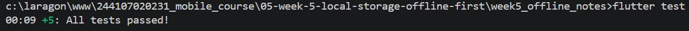 | 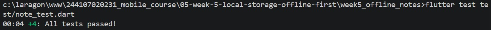 |

# Tugas dan Refleksi

Mode Pesawat

| Halaman Catatan Sebelum Sync | Halaman Catatan Sesudah Sync |
|---|---|
| 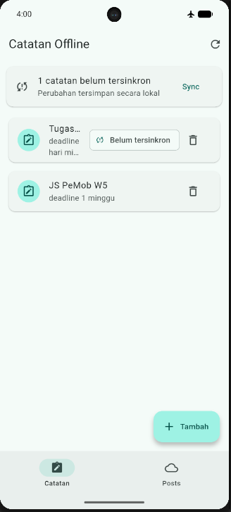 | 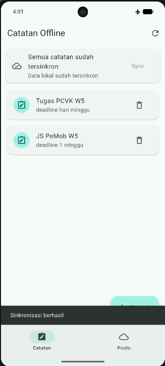 |

| Halaman Post Online | Halaman Post Offline |
|---|---|
| 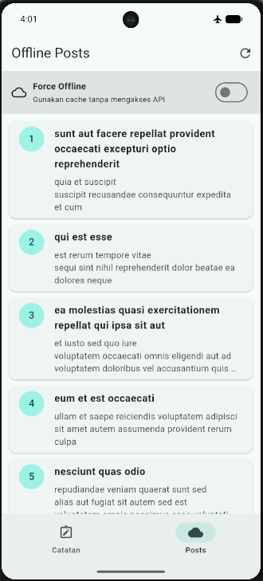 | 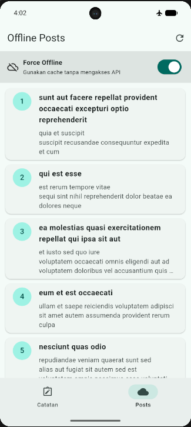 |

## 1. Mengapa daftar catatan tidak boleh disimpan di SharedPreferences? Apa yang rusak jika aturan ini dilanggar?

Daftar catatan tidak cocok disimpan di SharedPreferences karena catatan memiliki struktur data yang lebih kompleks dan jumlah datanya dapat terus bertambah. SQLite lebih sesuai karena mendukung tabel, pencarian, pengurutan, pembaruan, penghapusan, dan query terhadap banyak data.

Jika daftar catatan dipaksakan disimpan di SharedPreferences, data harus diubah menjadi string/JSON terlebih dahulu. Akibatnya proses CRUD menjadi lebih rumit dan tidak efisien. Semakin banyak catatan, semakin besar data yang harus dibaca dan ditulis sekaligus.

## 2. Kapan cache-first cukup, dan kapan Anda membutuhkan strategi lain (misalnya network-first untuk data harga real-time)?

Strategi cache-first cukup ketika pengguna tetap membutuhkan data walaupun tidak memiliki koneksi internet, sementara data tersebut tidak harus selalu terbaru setiap detik.

Namun, cache-first tidak selalu cocok untuk data yang membutuhkan informasi terbaru. Contohnya adalah harga saham, harga barang, kurs mata uang, ketersediaan tiket, data real-time lainnya.

Untuk data tersebut dapat digunakan strategi seperti network-first, yaitu aplikasi mencoba mengambil data terbaru dari server terlebih dahulu. Jika jaringan gagal, aplikasi dapat menggunakan cache sebagai cadangan.

## 3. Bagaimana dirty flag berubah menjadi antrean sync tanpa memblokir UI? Kapan antrean terpisah (tabel outbox) menjadi perlu?

Dirty flag dapat menjadi antrean sync sederhana karena setiap data yang berubah diberi tanda dirty = 1. Data tersebut tetap disimpan di SQLite sehingga UI tidak perlu menunggu server. Saat sinkronisasi dijalankan, aplikasi mengambil data yang dirty dan setelah berhasil mengubahnya menjadi dirty = 0. Jika kebutuhan sinkronisasi semakin kompleks, misalnya membutuhkan retry, pencatatan operasi create/update/delete, atau urutan perubahan, maka lebih tepat menggunakan tabel outbox terpisah.

## 4. Bagian mana dari rekomendasi AI yang Anda tolak, dan mengapa?

Salah satu pertimbangan yang tidak diikuti adalah menggunakan storage yang lebih kompleks hanya untuk mendapatkan fitur tambahan seperti reactive stream atau type-safety. Untuk project minggu ini, kompleksitas tersebut belum diperlukan karena kebutuhan aplikasi masih dapat dipenuhi menggunakan SQLite melalui repository.